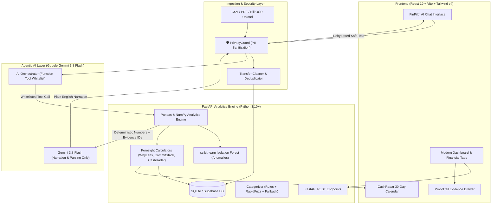

# 🧭 FinPilot — Personal Finance Decision Support Agent

> **"FinPilot does not just show where your money went. It shows what is already committed, warns you when cash will get tight, explains why spending changed, proves every insight with your own transactions, and shows what your choices mean for your goals."**

---

<div align="center">

[](https://www.python.org/)
[](https://fastapi.tiangolo.com/)
[](https://react.dev/)
[](https://vitejs.dev/)
[](https://ai.google.dev/)
[](https://tailwindcss.com/)
[](LICENSE)

**Agentic AI Hackathon &bull; Problem Statement 2: Personal Finance Decision Support Agent**

[Key Features](#-the-finpilot-foresight-layer-6-game-changers) &bull;
[Problem vs Solution](#-the-problem--the-gap) &bull;
[Architecture](#-system-architecture--design-rules) &bull;
[Quickstart](#-quickstart-guide) &bull;
[API Documentation](#-api-reference) &bull;
[Demo Walkthrough](#-hackathon-demo-walkthrough)

</div>

---

## 📌 Executive Summary

People make everyday financial decisions across multiple disjointed touchpoints: bank statements, credit card bills, UPI receipts, subscriptions, utility invoices, and spreadsheets. Existing personal finance apps (e.g., YNAB, Rocket Money, CRED, bank apps) mostly answer **"What did I spend?"** by looking backward.

**FinPilot is an AI-powered personal finance decision-support agent** that looks **forward** and **inward**. It does not offer speculative investment advice; instead, it empowers users with verifiable, explainable, and forward-looking financial clarity:

1. **What is already committed?** (Separating committed obligations from truly free disposable cash)
2. **When will cash get tight?** (Day-by-day 30-day cash flow pressure forecast)
3. **Why did spending change?** (Mathematical price vs. frequency driver decomposition)
4. **How do choices delay or accelerate goals?** (Interactive natural language what-if simulation)
5. **Where is the proof?** (Zero black-box hallucinations; 1-click transaction evidence for every insight)
6. **Is my private data secure?** (Client/Edge PII masking via PrivacyGuard before LLM ingestion)

---

## ⚡ The Problem & The Gap

| Financial Feature | How Existing Apps Do It (YNAB, CRED, Rocket Money) | The Limitation | 🧭 **How FinPilot Solves It** |
| :--- | :--- | :--- | :--- |
| **Auto-Categorization** | Tags transactions into categories (Food, Travel). | Does not explain *why* a category spiked or adapt to user edits. | **3-Tier Cascade + Learning Loop**: Rules &rarr; RapidFuzz &rarr; Gemini Fallback. Remembers user overrides permanently. |
| **Subscription Tracking** | Lists recurring subscriptions. | Misses silent price creep, overlapping apps, or annualized burden. | **Subscription Intelligence**: Detects price creep, duplicate streaming categories, and annualized costs. |
| **Budgeting** | Compares actual spending against a monthly target. | Looks backward. Ignores upcoming committed expenses. | **CommitStack**: Subtracts fixed commitments and savings goals to compute *Truly Free Cash*. |
| **Spending Charts** | Simple pie and bar charts. | Shows *what* was spent, never *why* it changed. | **WhyLens**: Decomposes category delta into Price Effect, Frequency Effect, New Merchants, and Outliers. |
| **Bill Reminders** | Due date notifications for individual bills. | Does not model when multiple bills cluster and squeeze cash. | **CashRadar**: 30-day day-by-day cash buffer forecast with safety threshold crossing alerts. |
| **AI Assistant / Chat** | Generative conversational bots. | Generates hallucinated numbers without underlying verifiable proof. | **Tool-Grounded Narration + ProofTrail**: Gemini only calls whitelisted analytical tools. Pandas does 100% of arithmetic. |
| **Goal Tracking** | Simple progress bar toward a target sum. | Disconnected from daily spending variances. | **GoalShift Ticker & Simulator**: Overspending dynamically moves goal completion dates; what-if scenario testing. |
| **Data Privacy** | Raw data sent to third-party cloud services. | Exposes names, card numbers, UPI IDs, and account numbers. | **PrivacyGuard**: Regex PII token masking replaces sensitive data before AI prompt ingestion; restored locally. |

---

## 🚀 The FinPilot Foresight Layer (6 Game Changers)

FinPilot sits on top of standard tracking with a proprietary **Foresight Layer** comprising six interconnected analytical systems:

```
                                  ┌────────────────────────────────────────────────────────┐
                                  │            FINPILOT FORESIGHT LAYER                    │
                                  └────────────────────────────────────────────────────────┘
          ┌───────────────────────┬────────────────────────┬───────────────────────┐
          ▼                       ▼                        ▼                       ▼
  🥞 CommitStack           📡 CashRadar             🔍 WhyLens              🎯 GoalShift
  Income Split into:       30-Day Day-by-Day        Driver Decomposition:   Delay Ticker & What-If
  • Committed Bills        Balance Simulation       • Price Effect          Natural Language
  • Goal Savings           Safety Line Margin       • Frequency Effect      Scenario Simulator
  • Variable Spend         Liquidity Crunch Alerts  • New Merchants         "Cut shopping by ₹1,000"
  • Truly Free Cash                                 • Outlier Spikes
          │                                                                        │
          └───────────────────────────────┬────────────────────────────────────────┘
                                          ▼
                         ┌─────────────────────────────────┐
                         │   🛡️ PrivacyGuard  &  🔍 ProofTrail
                         │   PII Sanitization    Explainable AI
                         │   Token Shield        Formula & Raw IDs
                         └─────────────────────────────────┘
```

### 1. 🥞 CommitStack (Commitment Stack)
*Splits monthly income into four distinct layers so you never accidentally spend money that is already spoken for.*
- **Layer 1: Committed** (Rent, EMIs, active subscriptions, utility bills due)
- **Layer 2: Goal Contributions** (Automated savings towards emergency fund, laptop, travel)
- **Layer 3: Typical Variable Spend** (Baseline groceries, transit, dining calculated from 3-month rolling median)
- **Layer 4: Truly Free Money** (The exact discretionary amount safe to spend without remorse)
> **Real Insight:** *"₹41,000 of your ₹60,000 income is already committed. ₹10,000 goes to goals. ₹6,500 is truly free."*

### 2. 📡 CashRadar (Cash-Flow Pressure Calendar)
*A day-by-day projected cash balance for the upcoming 30 days that warns you before cash gets tight.*
- **Formula:** $\text{Projected Balance}_t = \text{Balance}_{t-1} + \text{Expected Income}_t - \text{Obligations}_t - \text{Baseline Variable Spend}_t$
- Configurable **Safety Threshold Line** (e.g., ₹35,000 buffer).
- Flags high-risk dates where clustered payments (e.g. Rent + Credit Card bill + Insurance landing within 48 hours) will squeeze liquidity.
> **Real Warning:** *"Your balance may breach your ₹35,000 safety cushion on the 14th when rent and the card bill land within 2 days."*

### 3. 🔍 WhyLens (Driver-Based Why-Analysis)
*Explains spending variances through mathematical price-volume decomposition instead of vague summaries.*
Decomposes category spending deltas into four distinct mathematical forces:
$$\Delta \text{Spend} = \underbrace{(\bar{P}_{\text{curr}} - \bar{P}_{\text{prev}}) \times Q_{\text{prev}}}_{\text{Price Effect}} + \underbrace{(Q_{\text{curr}} - Q_{\text{prev}}) \times \bar{P}_{\text{curr}}}_{\text{Frequency Effect}} + \text{New Merchant Spend} + \text{Outliers}$$
> **Real Explanation:** *"Food is up ₹3,200: ₹1,900 from 9 extra food deliveries (Frequency), ₹800 from a new restaurant, ₹500 from higher average order value (Price)."*

### 4. 🎯 GoalShift (Goal Delay Ticker + What-If Simulator)
*Connects daily habits directly to personal aspirations, enabling conversational scenario testing.*
- **Dynamic Delay Ticker:** Overspending this month computes the exact number of days your goals will be delayed.
- **Natural Language What-If Simulator:** Type *"What if I cut dining out by ₹2,000?"* or *"What happens if I save an extra ₹1,500/month?"*
- Computes before-and-after timelines, target completion dates, and months saved.
> **Real Simulation:** *"Cutting dining out by ₹2,000/month moves your Emergency Fund completion date forward by 3.2 months (from May 2027 to Feb 2027)."*

### 5. 🔍 ProofTrail (Evidence Mode / Explainable AI)
*Complete transparency and zero hallucinations. Every number is 100% auditable.*
- Every insight card, metric, and AI chatbot answer features a **"Show Evidence"** button.
- Slides open an audit drawer containing:
  - The mathematical formula applied
  - The exact Pandas filters and aggregation logic
  - The raw transaction IDs and itemized records used in the calculation.

### 6. 🛡️ PrivacyGuard (Privacy Shield)
*Institutional-grade client & edge PII masking before any text or prompt reaches the LLM.*
- Regex tokenization masks Person Names, 16-digit Card Numbers, Bank Account Numbers, 10-digit Phone Numbers, and UPI IDs into reversible tokens (`[PERSON_1]`, `[ACCOUNT_1]`, `[UPI_1]`).
- The local token dictionary **never leaves the client/session**.
- Responses from Gemini are re-hydrated locally before display.

---

## 🏛️ System Architecture & Design Rules



### 📐 Strict Design Rules & Guardrails
1. **The AI Never Calculates:** Generative LLMs hallucinate math. All arithmetic, averages, variances, z-scores, and projections are computed strictly by **Pandas and NumPy**. Gemini is used solely for narrative synthesis, intent recognition, and bill text interpretation.
2. **Deterministic Tool-Based Answers:** Natural language queries trigger dedicated analytical tools returning typed JSON payloads accompanied by a unique `evidence_id`.
3. **Guardrails & Disclaimers:** FinPilot is a personal finance decision support tool, not an investment broker or financial advisor. Responses use soft recommendations (*"You could consider..."*) and display prominent disclaimers.
4. **Transfer Cleaner:** Automatic filtering of self-account transfers and credit card bill payments prevents double-counting expenses.

---

## 📊 Core Feature Matrix

### 1. 📂 Smart Upload & Bill-to-Obligation Extractor
- Support for **CSV bank statements**, **PDF statements**, and **bill images/invoices**.
- Automatically extracts merchant, transaction date, debit/credit type, amount, and running balance.
- Bill parser identifies one-off utility/insurance obligations, extracting amount due and due date directly into the obligations calendar.

### 2. 🏷️ Auto-Categorizer with Learning Loop
- **Stage 1 (Exact Rules):** Instant regex matching against standard merchant catalogs.
- **Stage 2 (RapidFuzz):** Fuzzy string distance matching for noisy POS terminal descriptions.
- **Stage 3 (Gemini Fallback):** LLM semantic fallback for cryptic merchant descriptors.
- **Continuous Learning Loop:** Low-confidence items flag a "Needs Review" badge. When a user updates a category, FinPilot remembers the override for all future statements.

### 3. 🔁 Recurring Payment & Subscription Intelligence
- Automatically clusters transactions by interval cadence (7, 14, 30, 365 days) and amount variance.
- **Price-Creep Detector:** Flags subscriptions that silently raised their monthly rates.
- **Duplicate Service Alerts:** Warns when multiple overlapping subscriptions are detected (e.g., Netflix + Prime Video + Disney+).
- **Annualized Cost View:** Reveals the true yearly burden of micro-subscriptions.

### 4. 🚨 Multi-Method Anomaly Detection
- **Isolation Forest & Robust Z-Scores:** Per-user statistical baselines flagging spending spikes exceeding 2.5 standard deviations.
- **Small-Spend Leak Detector:** Identifies clusters of micro-transactions (<₹150) that silently erode cash flow.
- **Double-Charge & Refund Finder:** Detects identical merchant charges posted within 48 hours.

### 5. 📈 Explainable Money Health Score
- Real-time **0–100 Money Health Score** broken into 5 transparent, auditable sub-pillars:
  1. *Budget Adherence (25 pts)*
  2. *Obligation Load Ratio (20 pts)*
  3. *Savings Rate Trend (20 pts)*
  4. *Cash Flow Safety Margin (20 pts)*
  5. *Goal Contribution Consistency (15 pts)*
- Every point deducted includes an actionable tip to improve your score.

---

## 💻 Tech Stack (100% Free Tier)

| Layer | Technology | Purpose |
| :--- | :--- | :--- |
| **Frontend UI** | **React 19, Vite, Tailwind CSS v4** | High-performance, responsive, reactive dashboard |
| **Icons & Charts** | **Lucide React, Recharts, Framer Motion** | Micro-animations, interactive area/bar charts, data visualizations |
| **Backend API** | **Python 3.10+, FastAPI, Pydantic v2, Uvicorn** | High-throughput asynchronous REST API & validation |
| **Core Analytics** | **Pandas, NumPy** | Deterministic aggregations, decompositions, cash flow projections |
| **Machine Learning** | **scikit-learn (Isolation Forest), RapidFuzz** | Anomaly detection, merchant fuzzy matching |
| **Document OCR** | **pypdf, Google Gemini Vision** | Parsing PDF statements and extracting bills into obligations |
| **Agentic AI** | **Google Gemini 3.8 Flash (`@google/genai`)** | Natural language tool dispatch, bill reading, conversational narration |
| **Privacy Layer** | **Custom Python Regex Tokenizer** | Client/Edge PII sanitization (PrivacyGuard) |
| **Database** | **SQLite (local zero-config) / Supabase Postgres** | Persistent transaction storage, budgets, goals, and user corrections |

---

## 📂 Project Structure

```
Finpilot_Project_Agentic_Ai_Hackathon/
├── backend/
│   ├── app/
│   │   ├── ai/
│   │   │   ├── orchestrator.py      # Gemini tool dispatcher & fallback logic
│   │   │   └── tools.py             # 14 whitelisted analytical tools called by Gemini
│   │   ├── analytics/
│   │   │   ├── anomalies.py         # Isolation Forest & Robust Z-Score detectors
│   │   │   ├── cash_radar.py        # 30-day forward cash balance projector
│   │   │   ├── categorization.py    # Rules + RapidFuzz + User Learning Loop
│   │   │   ├── cleaning.py          # Transfer cleaner & duplicate detector
│   │   │   ├── commit_stack.py      # 4-layer income split calculator
│   │   │   ├── evidence.py          # ProofTrail audit registry
│   │   │   ├── goal_shift.py        # Goal timeline ticker & what-if simulator
│   │   │   ├── monthly_summary.py   # Monthly totals, savings rate, health score
│   │   │   ├── recurring.py         # Recurring cadence detection
│   │   │   ├── subscriptions.py     # Price creep, overlaps & annualized cost
│   │   │   └── why_lens.py          # Mathematical price-volume decomposition
│   │   ├── ingestion/
│   │   │   ├── bill_parser.py       # Bill-to-obligation extractor
│   │   │   ├── csv_parser.py        # Robust bank CSV statement parser
│   │   │   └── pdf_parser.py        # PDF bank statement extractor
│   │   ├── privacy/
│   │   │   └── privacy_guard.py     # PII masking & token map restoration
│   │   ├── database.py              # SQLite schema initialization & connection pool
│   │   ├── main.py                  # FastAPI application routes & middleware
│   │   └── schemas.py               # Pydantic v2 request/response contracts
│   └── requirements.txt             # Python backend dependencies
├── data/
│   └── sample_transactions.csv      # Rich realistic synthetic dataset for demo
├── src/
│   ├── components/
│   │   ├── BudgetAlertToast.tsx     # Forward-looking 80% budget alert toast
│   │   ├── CashRadarTab.tsx         # 30-day cash flow pressure forecast & calendar
│   │   ├── CommitStackTab.tsx       # 4-layer income allocation visualizer
│   │   ├── FinPilotChat.tsx         # Conversational agent interface with quick prompts
│   │   ├── GoalShiftTab.tsx         # Goal delay ticker & what-if scenario tester
│   │   ├── Header.tsx               # App navigation, month selector, demo reload
│   │   ├── IntelligenceTab.tsx      # Subscriptions, anomalies, and budget health
│   │   ├── OverviewTab.tsx          # Health score, KPI cards, top spending
│   │   ├── ProofTrailDrawer.tsx     # Slide-over evidence drawer (Explainable AI)
│   │   ├── TransactionsTab.tsx      # Multi-filter search, review queue, category editor
│   │   └── UploadModal.tsx          # Multi-format statement & bill upload dialog
│   ├── engine/
│   │   └── analyticsEngine.ts       # Client-side fallback analytics engine
│   ├── api.ts                       # Typed frontend-to-backend API client
│   ├── App.tsx                      # Root component with tab routing & theme state
│   ├── index.css                    # Tailwind CSS v4 styling & animations
│   └── types.ts                     # TypeScript interface definitions
├── server.ts                        # Express orchestration server (Vite + FastAPI proxy)
├── package.json                     # Node.js dependencies & scripts
└── README.md                        # Documentation & project manual
```

---

## ⚡ Quickstart Guide

### Prerequisites
- **Node.js**: v18.0.0 or higher
- **Python**: v3.10 or higher
- **Google Gemini API Key**: [Get a free Gemini API Key](https://aistudio.google.com/)

---

### Step 1: Clone & Configure Environment

```bash
git clone https://github.com/Blessy27-CSBS/FinPilot.git
cd FinPilot
```

Create a `.env` file in the project root:

```env
# Gemini API Key for smart categorization, bill OCR & narrative agent
GEMINI_API_KEY=your_gemini_api_key_here
PORT=3000
```

---

### Step 2: Install Dependencies

#### 1. Backend Dependencies
```bash
pip install -r backend/requirements.txt
```

#### 2. Frontend Dependencies
```bash
npm install
```

---

### Step 3: Run the Application

#### Option A: Unified Launcher (Recommended)
Runs the Python FastAPI backend on `http://127.0.0.1:8000` and the Vite frontend on `http://localhost:3000` with automatic API reverse-proxying:

```bash
npm run dev
```

#### Option B: Run Services Individually

**Terminal 1 — Backend:**
```bash
python -m uvicorn backend.app.main:app --host 127.0.0.1 --port 8000 --reload
```

**Terminal 2 — Frontend:**
```bash
npm run dev
```

Open **`http://localhost:3000`** in your browser.

> [!TIP]
> **Pre-loaded Demo Data:** FinPilot automatically initializes an SQLite database with realistic multi-month synthetic transactions, active subscriptions, recurring bills, and savings goals. You can click **"Reset Demo Data"** in the top navigation bar at any time to restore the clean state.

---

## 🔌 API Reference

| Method | Endpoint | Description |
| :--- | :--- | :--- |
| `GET` | `/api/health` | Service health status check |
| `GET` | `/api/dashboard` | Aggregated dashboard data, health score, insights & KPIs |
| `POST` | `/api/upload` | Upload CSV/PDF statement or bill invoice |
| `GET` | `/api/transactions` | Paginated, filtered, and searchable transactions |
| `POST` | `/api/transactions/category`| Update transaction category (triggers Learning Loop) |
| `GET` | `/api/commit-stack` | 4-layer income allocation analysis |
| `GET` | `/api/cash-radar` | 30-day forward-looking day-by-day cash balance forecast |
| `GET` | `/api/why-lens` | Price-volume spending decomposition by category |
| `GET` | `/api/subscriptions` | Subscription intelligence (price creep, overlaps, annualized costs) |
| `GET` | `/api/anomalies` | Isolation Forest and Z-score outlier detection |
| `GET` | `/api/goals` | Savings goals with projected completion timelines |
| `POST` | `/api/goals/scenario` | Run what-if scenario against goals (*GoalShift*) |
| `GET` | `/api/evidence/{id}` | Retrieve ProofTrail mathematical formula and raw transaction IDs |
| `POST` | `/api/chat` | Conversational query to Gemini via whitelisted analytical tools |
| `GET` | `/api/monthly-report` | Comprehensive monthly report with audit trail |

---

## 🎬 Hackathon Demo Walkthrough

Follow this 3-minute sequence to test every capability of FinPilot:

```
1. OVERVIEW TAB
   └── Examine the 0–100 Money Health Score breakdown.
   └── Review the 4 KPI summary cards (Income, Committed, Free Money, Savings Rate).
   └── Click "Show Evidence" on the CommitStack AI insight card to view the formula & raw transactions.

2. COMMITSTACK TAB
   └── See the visual breakdown of Income into Committed, Goals, Variable, and Truly Free Money.
   └── Understand exactly how much cash is safe to spend today.

3. CASHRADAR TAB
   └── View the 30-day forward balance chart.
   └── Notice the safety threshold line at ₹35,000.
   └── Observe the flagged risk date on the 14th where rent & credit card bills collide.
   └── Adjust the Safety Buffer slider to observe dynamic risk recalculation.

4. WHYLENS TAB
   └── Select the "Food & Dining" category.
   └── Read the decomposition: Price Effect vs. Frequency Effect vs. New Merchants.
   └── Click any outlier transaction to open its itemized record.

5. GOALSHIFT TAB
   └── Check the "Goal Delay Ticker" showing how last month's overspending delayed goals.
   └── Test the Natural Language What-If Simulator:
       Type: "What if I cut food delivery by ₹2,000?"
   └── View the instant before/after completion date shift.

6. FINPILOT CHAT
   └── Ask: "Where did I spend the most this month?"
   └── Ask: "Which subscriptions am I paying for?"
   └── Ask: "How much of my budget is already committed?"
   └── Click "Show Evidence" under any AI response to inspect the deterministic tool output.
```

---

## 🔒 Security, Privacy & Responsible AI

- **Privacy by Design:** `PrivacyGuard` sanitizes all Personally Identifiable Information (PII) before it is transmitted across network boundaries.
- **Explainable AI (XAI):** No generative hallucinations. Every statistic is derived mathematically from Pandas aggregations, and every number links directly to its underlying database IDs.
- **Client-Side Fallback:** If the backend or cloud LLM is unreachable, FinPilot's client-side analytics engine computes metrics in-browser seamlessly.

---

## 👥 Authors & Acknowledgments

- Built with ❤️ for the **Agentic AI Hackathon (Problem Statement 2)**.
- Powered by Google Gemini 3.8 Flash, FastAPI, and React.

---

<div align="center">
  <sub>FinPilot is a decision-support and financial intelligence tool. It does not provide certified financial, legal, or investment advice.</sub>
</div>
